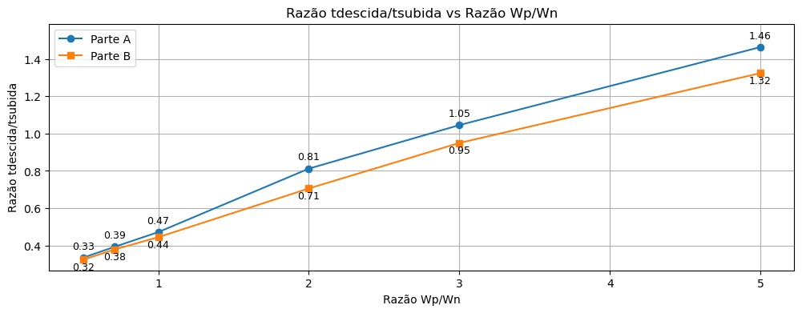

# VLSI CMOS Project

Este repositório contém o projeto de caracterização de inversores CMOS (0,13µm).

## Estrutura do Repositório

- `Inversores/`: Arquivos de simulação
- `Osciladores/`: Arquivos de simulação
- `docs/`: Documentos
- `Figuras/`: Figuras em geral

## Propósito da Pesquisa

Este projeto foi realizado como parte da disciplina "Introdução ao Projeto de Sistemas VLSI em CMOS" na USP. O objetivo da pesquisa é caracterizar inversores através da simulação de osciladores em anel com 7 inversores cada, utilizando o processo CMOS de 0,13µm e modelos avançados BSIM-3.

"Desejamos caracterizar inversores e para tal considere que se tenha projetado osciladores em anel com 7 inversores cada num processo CMOS 0,13µm. Simule estes osciladores com SPICE (ou similar, mas com modelo avançado BSIM-3). O layout deve ser desenhado usando-se regras para dimensões e espaçamentos mínimos possíveis da tecnologia 0,13µm CMOS. Considerar que a soma das larguras (W) dos canais dos transistores nMOS e pMOS seja igual a 2,4µm em cada inversor do oscilador. Adote os valores Wp e Wn dos transistores nos inversores a serem adotados em cada oscilador apresentados na tabela, onde P/N = (WP/WN), e use Ln = Lp = 0,13µm (mínima permitida pela tecnologia). Considere VDD – VSS = 1,2V valor típico da tecnologia."

| Wp/Wn | pMOS (Wp) em µm  | nMOS (Wn) em µm  |
|-------|------------------|------------------|
| 5.00  | 2                | 0.4              |
| 3.00  | 1.8              | 0.6              |
| 2.00  | 1.6              | 0.8              |
| 1.00  | 1.2              | 1.2              |
| 0.71  | 1.0              | 1.4              |
| 0.50  | 0.8              | 1.6              |

## Descrição

O projeto envolve a realização de simulações no Cadence e SPICE, abordando os seguintes tópicos:

- Regiões operacionais dos transistores MOSFET
- Análise de capacitâncias
- Dimensionamento de transistores
- Trade-offs entre velocidade e consumo de energia
- Simulações e validação prática

### Parte A e B

- Desenhar o inversor com Wp e Wn no Cadence.
- Desenhar o oscilador em anel com dimensão mínima e extrair os parâmetros do circuito.
- Simular os osciladores usando os parâmetros "WORST CASE SPEED (WCS)" com VDD – VSS = 1,08 V e temperatura da junção = 125º C.
- Plotar tdescida/tsubida em função da razão P/N, td em função da razão P/N, e Imax em função da razão P/N.
- Simular os osciladores usando os parâmetros "WORST CASE POWER (WCP)" com VDD – VSS = 1,32 V e temperatura da junção 0ºC.
- Plotar tdescida/tsubida vs P/N, td vs P/N, e Imax vs P/N.

#### Desenhos

- **Inversor**
- Esquemático
  
  

- Layout
  
  

- **Oscilador**
- Esquemático
  
  

- Layout
  
  

#### Dados Coletados

**Parte A:**

| Osc. pMOS (Wp) | nMOS (Wn) | P/N | Período de Oscilação (ps) | td (ps) | tdescida (ps) | tsubida (ps) | tdr (ps) | tdf (ps) | Imax (uA) |
|----------------|-----------|-----|---------------------------|---------|---------------|--------------|----------|----------|------------|
| 2.00           | 0.40      | 5.00| 564.60                    | 40.33   | 64.91         | 44.36        | 33.85    | 46.18    | 146.30     |
| 1.80           | 0.60      | 3.00| 484.70                    | 34.62   | 46.19         | 44.19        | 32.06    | 36.90    | 155.70     |
| 1.60           | 0.80      | 2.00| 447.70                    | 31.98   | 37.02         | 45.59        | 31.79    | 32.02    | 155.40     |
| 1.20           | 1.20      | 1.00| 455.80                    | 32.56   | 30.77         | 65.18        | 37.09    | 27.71    | 133.80     |
| 1.00           | 1.40      | 0.71| 492.18                    | 35.16   | 30.66         | 77.97        | 42.94    | 27.35    | 115.50     |
| 0.80           | 1.60      | 0.50| 562.36                    | 40.17   | 32.55         | 97.19        | 52.97    | 27.29    | 93.92      |

**Parte B:**

| Osc. pMOS (Wp) | nMOS (Wn) | P/N | Período de Oscilação (ps) | td (ps) | tdescida (ps) | tsubida (ps) | tdr (ps) | tdf (ps) | Imax (uA) |
|----------------|-----------|-----|---------------------------|---------|---------------|--------------|----------|----------|------------|
| 2.00           | 0.40      | 5.00| 278.10                    | 19.86   | 32.50         | 24.55        | 16.46    | 23.17    | 363.40     |
| 1.80           | 0.60      | 3.00| 242.00                    | 17.29   | 23.76         | 25.02        | 16.08    | 18.48    | 379.10     |
| 1.60           | 0.80      | 2.00| 225.30                    | 16.09   | 19.43         | 27.53        | 16.13    | 16.04    | 369.30     |
| 1.20           | 1.20      | 1.00| 229.94                    | 16.42   | 16.52         | 37.13        | 19.77    | 13.08    | 314.90     |
| 1.00           | 1.40      | 0.71| 247.39                    | 17.67   | 16.63         | 43.87        | 23.20    | 12.10    | 273.90     |
| 0.80           | 1.60      | 0.50| 280.75                    | 20.05   | 17.74         | 54.74        | 28.84    | 11.24    | 222.10     |

#### Gráficos

- **Razão tdescida/tsubida vs Razão Wp/Wn (Parte A e Parte B)**
  

- **Atraso Médio dos Inversores (td) vs Razão Wp/Wn (Parte A e Parte B)**
  

- **Corrente de Pico (Imax) vs Razão Wp/Wn (Parte A e Parte B)**
  

### Parte C

- Determinar a melhor razão P/N baseada nos dados obtidos nas partes A e B.
- Plotar atrasos td normalizados com respeito ao valor mínimo de cada caso.

#### 1. Identificação da Melhor Razão P/N

Para identificar a melhor razão P/N, analisamos os tempos de atraso (td) de cada oscilador nas partes A e B.

| Wp/Wn | td Parte A (ps) | td Parte B (ps) |
|-------|------------------|------------------|
| 5.00  | 40.33            | 19.86            |
| 3.00  | 34.62            | 17.29            |
| 2.00  | 31.98            | 16.09            |
| 1.00  | 32.56            | 16.42            |
| 0.71  | 35.16            | 17.67            |
| 0.50  | 40.17            | 20.05            |

A melhor razão P/N é 2.00, pois apresenta o menor tempo de atraso em ambas as partes.

#### 2. Plotar os Atrasos td Normalizados

Os atrasos normalizados são calculados dividindo todos os td pelo menor valor de td encontrado para cada parte e multiplicando por 100.

- **td Normalizado vs Razão Wp/Wn (Parte A e Parte B)**
  

### Parte D

- Simular um oscilador com Wp/Wn ótimo.
- Analisar o atraso (td) médio dos inversores e a dissipação de potência/MHz de cada inversor variando-se a tensão VDD – VSS.
- Plotar tdmédio vs (VDD – VSS) e P/MHz vs (VDD – VSS).

#### Simulação com Oscilador Otimizado

A razão Wp/Wn ótima identificada foi de 2.00.

Resultados Simulados:

| VDD – VSS (V) | Período (ps) | Tempo de Atraso (ps) | Potência Média (uW) | Frequência (MHz) | Potência por MHz (uW/MHz) |
|---------------|--------------|----------------------|----------------------|------------------|---------------------------|
| 0.96          | 419.9        | 29.99                | 18.10                | 2381             | 0.0076                    |
| 1.08          | 346.1        | 24.72                | 28.05                | 2889             | 0.0097                    |
| 1.20          | 298.2        | 21.30                | 40.60                | 3354             | 0.0121                    |
| 1.32          | 264.8        | 18.92                | 55.91                | 3778             | 0.0148                    |
| 1.44          | 240.4        | 17.17                | 74.07                | 4163             | 0.0178                    |

Gráficos de Atraso Médio dos Inversores e Potência por MHz:

- **Atraso Médio dos Inversores (td) vs. VDD – VSS**
  

- **Potência por MHz vs. VDD – VSS**
  

### Parte E

- Analisar a influência do tdescida e tsubida do sinal de entrada e saída do inversor no valor de Imax.

#### Análise da Influência do tdescida e tsubida no Imax

Os gráficos mostram a diferença entre o tempo de descida da saída e o tempo de subida da entrada (tfout - trin) e como isso afeta Imax.

- **Erro (tdescida,out - tsubida,in) vs P/N**
  

## Conclusão

A realização deste projeto permitiu uma compreensão aprofundada dos diversos aspectos do design de inversores CMOS e suas aplicações em osciladores em anel. Através da execução de simulações no Cadence e SPICE, várias competências e conhecimentos cruciais foram desenvolvidos:

- Regiões Operacionais dos Transistores MOSFET: A análise detalhada das regiões de corte, triode e saturação forneceu uma base sólida para entender como os transistores MOSFET operam e influenciam o comportamento dos circuitos sob diferentes condições de operação.

- Análise de Capacitâncias: Os cálculos de capacitâncias em diferentes configurações e regiões operacionais ajudaram a entender como os aspectos físicos dos transistores, como área e perímetro, afetam suas propriedades elétricas e desempenho do circuito.

- Dimensionamento de Transistores e Análise de Trade-offs: Ajustar as dimensões de Wp e Wn e estudar seu impacto no desempenho do circuito permitiu uma compreensão prática dos trade-offs entre velocidade e consumo de energia, crucial para otimizar designs de circuitos.

- Validação Prática com Simulação: Comparar cálculos manuais com resultados de simulações usando Cadence ofereceu uma valiosa verificação prática, destacando a precisão das técnicas de cálculo e revelando áreas para ajustes finos nas estimativas e modelos teóricos.

- Aplicações das Teorias em Contexto Real: Utilizar literatura técnica e especificações de PDK (Process Design Kit) para aplicar teoricamente e verificar praticamente como os princípios de design influenciam o resultado final em um projeto de VLSI.

Os resultados obtidos demonstram a importância da otimização cuidadosa das proporções de largura dos transistores pMOS e nMOS em projetos de circuitos VLSI, particularmente para designs onde o tempo de atraso é uma métrica crítica de desempenho. Além disso, os gráficos gerados fornecem uma base quantitativa para tomar decisões informadas sobre as especificações de design e operação dos osciladores CMOS.

Este projeto não apenas solidificou a compreensão dos fundamentos teóricos, mas também melhorou a habilidade em aplicar esses conceitos em cenários práticos de engenharia, preparando para desafios mais complexos no design de sistemas integrados.
